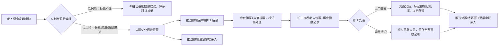
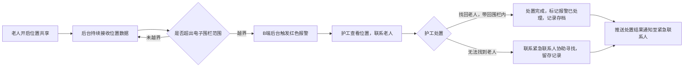
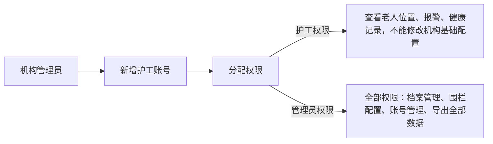

## 1. 老人紧急求助完整业务流程

```mermaid
flowchart LR
    A[老人语音发起求助] --> B{AI判断风险等级}
    B -->|低风险：轻微不适| C[AI给出基础健康建议，保存对话记录]
    B -->|高风险：头晕/胸痛/跌倒描述| D[C端APP语音报警]
    D --> E[推送报警至B端护工后台]
    D --> K[推送报警至紧急联系人]
    E --> F[后台弹窗+声音提醒，标记待处理]
    F --> G[护工查看老人位置+历史健康记录]
    G --> H{护工处置}
    H -->|上门查看| I[处置完成，标记报警已处理，记录存档]
    H -->|紧急情况| J[呼叫急救人员，留存完整事故记录]
    I --> L[推送处置结果通知至紧急联系人]
    J --> L
``` 

## 2. 老人定位越界报警流程

```mermaid
flowchart LR
    A[老人开启位置共享] --> B[后台持续接收位置数据]
    B --> C{是否超出电子围栏范围}
    C -->|未越界| B
    C -->|越界| D[B端后台触发红色报警]
    D --> E[护工查看位置，联系老人]
    E --> F{护工处置}
    F -->|找回老人，带回围栏内| G[处置完成，标记报警已处理，记录存档]
    F -->|无法找到老人| H[联系紧急联系人协助寻找，留存记录]
    G --> I[推送处置结果通知至紧急联系人]
    H --> I
``` 

## 3. 机构账号权限流程

```mermaid
flowchart LR
    A[机构管理员] --> B[新增护工账号]
    B --> C[分配权限]
    C -->|护工权限| D[查看老人位置、报警、健康记录，不能修改机构基础配置]
    C -->|管理员权限| E[全部权限：档案管理、围栏配置、账号管理、导出全部数据]
``` 